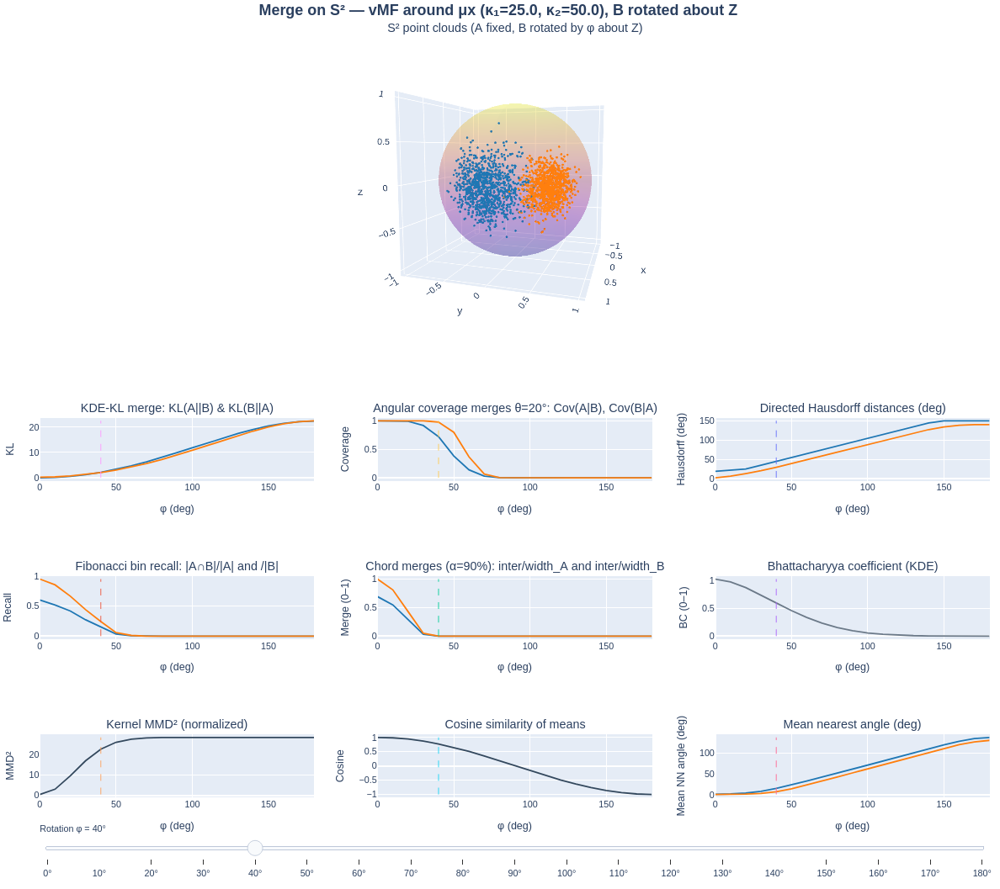

# S² Overlap / Merge Metrics — Interactive Plotly Dashboard




**Interactive playground to compare two point distributions on the unit sphere (S²).**
Rotate one cloud about the _z_-axis and visualize **overlap** or **merge** metrics side‑by‑side with an animated 3D view.

> **TL;DR**
> Run `python s2_plotly_rotation_demo.py` and open the generated HTML. Use the slider to rotate the orange cloud (B) around _z_ while the blue cloud (A) stays fixed. Pick metrics with `--metrics`, choose generators with `--gen-model` (`vmf`/`gaussian`/`cauchy`), and tune visual layout with `--scene-frac` and `--fig-height`.

---

## Features

- **Two analysis modes**
  - **Overlap** (symmetric) — measure how much the two distributions coincide.
  - **Merge** (directional) — report A→B and B→A for directional metrics (e.g., KL(A‖B) vs. KL(B‖A)).
- **Rotationally symmetric generators for `--mode gen`**
  - **`vmf` (default)** von Mises–Fisher about μₓ (exact, isotropic) with `--kappa1`, `--kappa2`.
  - **`gaussian`** sample `N(μ, σ² I)` then project to S² with `--sigma1`, `--sigma2`.
  - **`cauchy`** legacy projected Cauchy via `--gamma1`, `--gamma2` (kept for comparison).
- **Your own data** via `--mode pt` (expects `.pt` with `{"A": tensor, "B": tensor}` or `(A,B)`).
- **Metric families (select with `--metrics`)**
  - **Symmetric**: `bc`, `mmd`, `ovl`, `mean_angle`, `mean_cos`, `hausdorff`, `fib_jaccard`, `hp_jaccard`, `chord_overlap`.
  - **Directional**: `kl`, `cov_dir`, `haus_dir`, `fib_recall`, `hp_recall`, `chord_merge`, `prox_cov`, `mean_nn`.
- **New proximity metrics (directional)**
  - `prox_cov`: fraction of points within `--prox-deg` degrees of the other cloud.
  - `mean_nn`: mean nearest‑neighbor geodesic angle (A→B, B→A in degrees).
- **UI polish**
  - Bold, **dynamic title** that reflects generator + mode.
  - **No legend clutter** (merge lines reuse point‑cloud colors; overlap uses neutral tones).
  - **Autoscale / Reset** buttons on every 2D panel.
  - **Visible slider** (progress bar) with extra bottom padding.
  - **Flexible layout**: choose the vertical size of the 3D scene (`--scene-frac`) and the overall figure height (`--fig-height`).

---

## Usage

### Example with 3D Sphere
```bash
bash demo_merge.sh
```

### Example for how to use with your own Pytorch file
```bash
python s2_plotly_rotation_demo.py --mode pt --pt your_points.pt --metric-mode merge --out-html s2_merge_pt.html
```

## Description of Each Metric

| Key             | Panel title (typical)           | Direction   | Notes                                                          |
| --------------- | ------------------------------- | ----------- | -------------------------------------------------------------- |
| `bc`            | Bhattacharyya coefficient (KDE) | symmetric   | Uses spherical KDE with `β` and normalization `Zβ= sinhβ / β`. |
| `mmd`           | Kernel MMD² (normalized)        | symmetric   | `MMD² = (kAA + kBB - 2kAB)/Zβ`.                                |
| `ovl`           | Angular coverage overlap θ      | symmetric   | Fraction of A (and B) within θ of the other; averaged.         |
| `mean_angle`    | Angle between mean directions   | symmetric   | Uses μ̂A, μ̂B.                                                   |
| `mean_cos`      | Cosine similarity of means      | symmetric   | μ̂A·μ̂B                                                          |
| `hausdorff`     | Hausdorff distance (deg)        | symmetric   | Geodesic; `max(A→B, B→A)`.                                     |
| `fib_jaccard`   | Fibonacci bins Jaccard          | symmetric   | Occupancy overlap on spherical Fibonacci grid.                 |
| `hp_jaccard`    | HEALPix Jaccard                 | symmetric   | Requires `healpy` or internal Fibonacci fallback.              |
| `chord_overlap` | Chord overlap (α%)              | symmetric   | On common great circle; α‑mass arcs.                           |
| `kl`            | KDE‑KL merge (A‖B, B‖A)         | directional | Leave‑one‑out for self terms.                                  |
| `cov_dir`       | Coverage merges θ               | directional | Cov(A given B), Cov(B given A).                                |
| `haus_dir`      | Directed Hausdorff              | directional | A→B and B→A in degrees.                                        |
| `fib_recall`    | Fibonacci bin recall            | directional | A∩B/A  and A∩B/B                                               |
| `hp_recall`     | HEALPix bin recall              | directional | As above with HEALPix cells.                                   |
| `chord_merge`   | Chord merges (α%)               | directional | inter/width_A, inter/width_B.                                  |
| `prox_cov`      | Proximity coverage @ δ          | directional | Fraction within `≤ δ°` to other cloud.                         |
| `mean_nn`       | Mean nearest angle (deg)        | directional | Mean geodesic min distances.                                   |


## Command‑line arguments (high level)

### Core

-    --mode {gen,pt}: Generate or load data. Default: gen.
-    --metric-mode {overlap,merge}: Symmetric vs directional metrics.
-    --metrics <list>: Comma‑separated keys or all (default).

### Generators (for --mode gen)

-    --gen-model {vmf,gaussian,cauchy} (default: vmf).
-    vMF: --kappa1, --kappa2 (concentration; higher → tighter).
-    Gaussian (projected): --sigma1, --sigma2.
-    Cauchy (projected): --gamma1, --gamma2 (or --gamma for both).

### Input (--mode pt)

-   .pt must contain either {"A": tensor, "B": tensor} or (A, B) with shape (n,3); the script renormalizes to S².

### Metrics & parameters

-    Spherical KDE kernel: kβ(x,y)=exp(β x·y)/Zβ; --beta (default: 12).
-    Angular threshold for coverage: --theta-deg (default: 60).
-    Proximity threshold: --prox-deg (default: 15).
-    Chord method mass: --alpha-chord (default: 0.9).
-    Binning: --fib-N (Fibonacci grid size), --healpix-nside (if healpy available).

### Figure & style

-    --color-A, --color-B (merge lines inherit these).
-    --marker-size (3D point size), --plot-subset (max points rendered in 3D).
-    --fig-height (px), --scene-frac (fraction of height for the 3D row).
-    Outputs: --out-html, --out-csv.

## Outputs

*HTML:*
interactive Plotly figure (3D scene + selected panels), animated via slider. Modebar includes Autoscale and Reset axes for every 2D panel.

*CSV:*
per‑angle metrics for each selected series, column names mirror panel labels.

